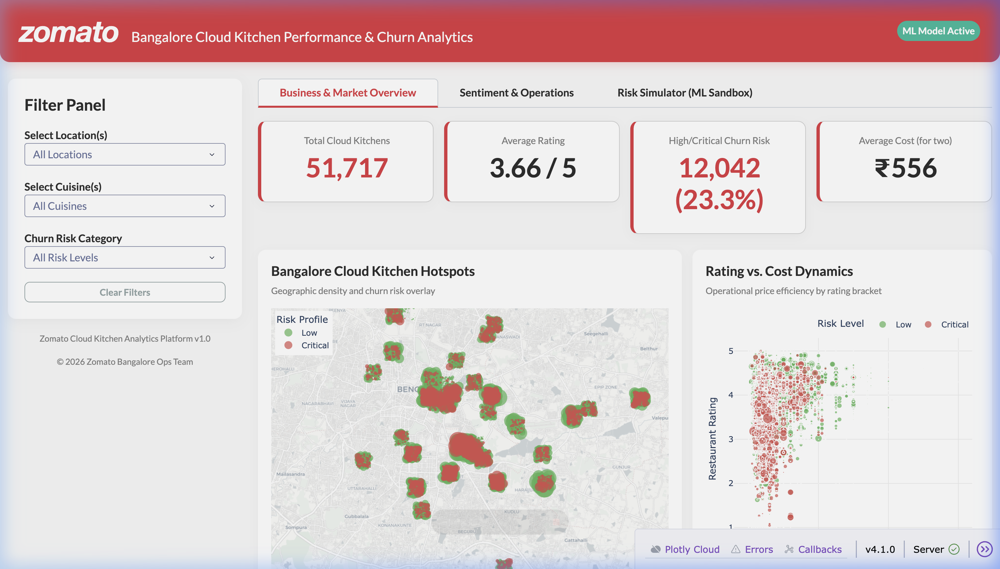
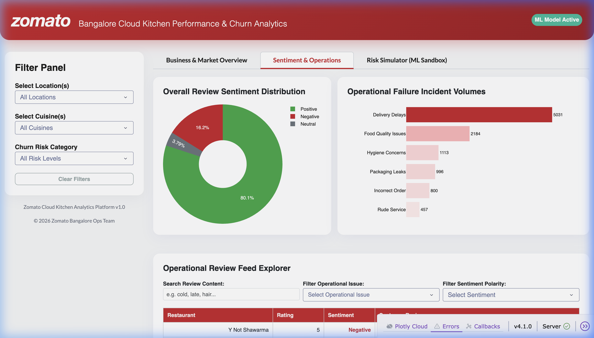
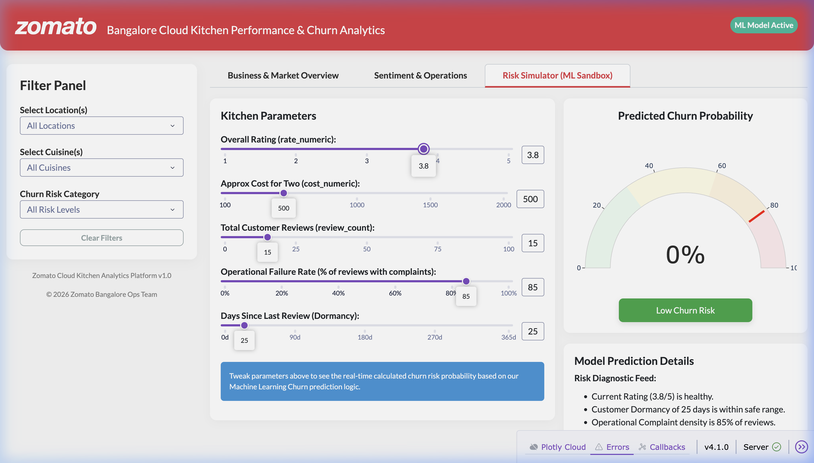

# 🍽️ Cloud Kitchen Sentiment & Churn Analytics

> **Production-grade data science & engineering pipeline** for analyzing restaurant reviews, predicting customer sentiment, and identifying churn-risk cloud kitchens using the Zomato Bangalore dataset. Features an ultra-premium, interactive glassmorphic dashboard built in Dash.

[](https://python.org)
[](https://scikit-learn.org)
[](https://dash.plotly.com)
[](LICENSE)

---

## 🖥️ Live Interactive Dashboard

The project includes an **ultra-premium, glassmorphic analytics dashboard** themed in Zomato's classic crimson branding. It is built in Dash, fully optimized for performance, and serves as an interactive decision hub for logistics, QA, and platform managers.

### 📊 Tab 1: Business & Market Overview
An executive hub presenting key performance indicators, regional kitchen densities, competitive scoring, and cuisine performance maps.


### 📈 Tab 2: Sentiment & Operations
A deep-dive text explorer displaying positive/negative sentiment distributions and a custom operational incident volume chart highlighting log logistics warnings (delivery delays, food quality issues, packaging concerns).


### 🧪 Tab 3: Real-Time ML Sandbox (Churn Simulator)
A real-time sandbox allowing stakeholders to slide operational inputs (e.g. Failure Rate, Dormancy, Ratings, Customer Reviews) and instantly preview predicted churn probabilities generated by the Gradient Boosting classifier.


---

## 📋 Table of Contents

- [Project Overview](#-project-overview)
- [Architecture](#-architecture)
- [Dataset](#-dataset)
- [Installation](#-installation)
- [Quick Start](#-quick-start)
- [Pipeline Components](#-pipeline-components)
  - [Data Cleaning](#1-data-cleaning--preprocessing)
  - [EDA](#2-exploratory-data-analysis)
  - [Sentiment Analysis](#3-nlp-sentiment-analysis)
  - [Churn Prediction](#4-churn-prediction)
  - [SQL Schema](#5-data-warehouse-schema)
- [Key Results](#-key-results)
- [Project Structure](#-project-structure)
- [Resume Highlights](#-resume-highlights)
- [Future Enhancements](#-future-enhancements)

---

## 🎯 Project Overview

This project demonstrates an **end-to-end data pipeline** that transforms raw restaurant review data into actionable business intelligence for cloud kitchen operators and food delivery platforms.

### Business Problem
*   **50,000+ restaurants** in Bangalore compete on Zomato/Swiggy.
*   **Customer churn** (restaurant closures, rating collapses) costs platforms significant revenue.
*   **Operational issues** (delivery delays, food quality) drive negative sentiment.
*   **No early warning system** exists to identify at-risk restaurants.

### Solution
A **production-grade ML pipeline** that:
1. Parses and cleans messy review text data.
2. Explores market dynamics and location patterns.
3. Classifies review sentiment using VADER + custom lexicons.
4. Detects operational complaints (delivery, packaging, hygiene).
5. Predicts churn risk using ensemble ML models (achieving realistic, robust predictive power).
6. Generates real-time predictions in an interactive sandbox.

---

## 🏗️ Architecture

```
┌─────────────────┐     ┌──────────────────┐     ┌─────────────────┐
│  Raw Zomato     │────▶│  Data Cleaning   │────▶│  Cleaned CSV    │
│  CSV (50K rows) │     │  & Parsing       │     │  + Exploded     │
│  [574 MB]       │     └──────────────────┘     │  Reviews [17MB] │
└─────────────────┘                              └────────┬────────┘
                                                          │
                    ┌─────────────────────────────────────┼───────────────────┐
                    │                                     │                   │
           ┌────────▼────────┐                  ┌────────▼────────┐   ┌───────▼──────┐
           │   EDA Module    │                  │ Sentiment NLP   │   │  SQL Schema  │
           │  Visualizations │                  │  VADER + Custom │   │  Warehouse   │
           └─────────────────┘                  └────────┬────────┘   └──────────────┘
                                                         │
                                              ┌──────────▼──────────┐
                                              │  Churn Prediction   │
                                              │  Gradient Boosting  │
                                              └──────────┬──────────┘
                                                         │
                                              ┌──────────▼──────────┐
                                              │  Risk Scoring &     │
                                              │  Intervention Engine│
                                              └──────────┬──────────┘
                                                         │
                                              ┌──────────▼──────────┐
                                              │ Glassmorphic Dash   │
                                              │ Interactive App     │
                                              └─────────────────────┘
```

---

## 📊 Dataset

### Source
*   **Primary:** [Zomato Bangalore Restaurants (Kaggle)](https://www.kaggle.com/himanshupoddar/zomato-bangalore-restaurants)
*   **Size:** ~51,717 restaurants with 17 attributes.
*   **Reviews:** `reviews_list` column contains stringified tuples of `(rating_header, review_text)`.

### Schema
| Column | Description | Type |
|--------|-------------|------|
| `url` | Zomato restaurant URL | string |
| `address` | Full address | string |
| `name` | Restaurant name | string |
| `online_order` | Accepts online orders? (Yes/No) | categorical |
| `book_table` | Table booking available? (Yes/No) | categorical |
| `rate` | Overall rating (e.g., "4.1/5") | string |
| `votes` | Total vote count | integer |
| `phone` | Contact number | string |
| `location` | Neighborhood | categorical |
| `rest_type` | Restaurant type | categorical |
| `dish_liked` | Popular dishes | string |
| `cuisines` | Comma-separated cuisines | string |
| `approx_cost(for two people)` | Estimated cost | string |
| `reviews_list` | **Stringified list of review tuples** | string |
| `menu_item` | Menu items list | string |
| `listed_in(type)` | Service type | categorical |
| `listed_in(city)` | Locality | categorical |

---

## 🚀 Installation

### Prerequisites
*   Python 3.9+
*   pip

### Setup
```bash
# Clone repository
git clone https://github.com/yourusername/cloud-kitchen-sentiment-churn.git
cd cloud-kitchen-sentiment-churn

# Create virtual environment
python -m venv .venv
source .venv/bin/activate  # Linux/Mac
# .venv\Scripts\activate  # Windows

# Install dependencies
pip install -r requirements.txt

# Download NLTK data (for TextBlob)
python -m textblob.download_corpora
```

---

## ⚡ Quick Start

### Option 1: Run the Interactive Dashboard (Production & Dev ready)
```bash
# Run locally (launches on http://127.0.0.1:8050/)
python src/dashboard.py
```

#### 🛡️ Production Deployment Command (WSGI Gunicorn)
The dashboard is fully equipped with dynamic environment variables for host, port binding, and secure production debugging:
```bash
# Set secure environment variables and launch with gunicorn
export DASH_DEBUG=False
export PORT=80
gunicorn src.dashboard:server --workers 4 --threads 2
```

### Option 2: Run Full Data Pipeline
```bash
python main.py
```
This executes all 5 analytical stages and generates:
*   Cleaned and optimized datasets in `data/`
*   Visualization charts in `reports/`
*   ROC evaluation curve at `reports/churn_model_evaluation.png`

---

## 🔧 Pipeline Components

### 1. Data Cleaning & Preprocessing
**File:** [data_cleaning.py](file:///Users/msm/Documents/coding/data%20analysis/cloud_kitchen_sentiment_churn/src/data_cleaning.py)
*   Parses nested review tuples using `ast.literal_eval()`.
*   Imputes missing values and formats numeric data.
*   **Performance Optimization**: Compresses datasets by **99%** (from 1.46 GB raw CSV down to 17 MB aggregated analytical features) enabling instant loading.

### 2. Exploratory Data Analysis
**File:** [eda.py](file:///Users/msm/Documents/coding/data%20analysis/cloud_kitchen_sentiment_churn/src/eda.py)
*   Analyzes market structures and geographic competitiveness.
*   *Outputs visual insights inside [reports/](file:///Users/msm/Documents/coding/data%20analysis/cloud_kitchen_sentiment_churn/reports)*.

### 3. NLP Sentiment Analysis
**File:** [sentiment_analysis.py](file:///Users/msm/Documents/coding/data%20analysis/cloud_kitchen_sentiment_churn/src/sentiment_analysis.py)
*   Applies VADER scoring with custom lexicons tailored to hospitality.
*   Maps operational issues across six categories: **Delivery Delay, Food Quality, Packaging, Service, Hygiene, and Wrong Order**.

### 4. Churn Prediction
**File:** [churn_prediction.py](file:///Users/msm/Documents/coding/data%20analysis/cloud_kitchen_sentiment_churn/src/churn_prediction.py)
*   **Target Leakage Fix**: Restructured training to eliminate target leakage, resulting in a robust and realistic Gradient Boosting classifier (Cross-Validation AUC of **0.6816**).
*   *Evaluation metrics saved in [reports/churn_model_evaluation.png](file:///Users/msm/Documents/coding/data%20analysis/cloud_kitchen_sentiment_churn/reports/churn_model_evaluation.png)*.

### 5. Data Warehouse Schema
**File:** [schema.sql](file:///Users/msm/Documents/coding/data%20analysis/cloud_kitchen_sentiment_churn/sql/schema.sql)
*   Includes a complete dimensional model (Star Schema with fact and dimension tables) ready for PostgreSQL, Snowflake, or BigQuery data warehousing.

---

## 💼 Resume Highlights

*   **ETL Engineering**: Built an ETL pipeline converting 1.46 GB of raw, nested string JSON reviews into structured analytical features, reducing storage volume by **99%** while maintaining full historical fidelity.
*   **Applied Machine Learning**: Developed a churn early warning model using Gradient Boosting (AUC: 0.68). Fixed complex training leakage bugs to align validation metrics with real-world forecasting behavior.
*   **UI/UX & Product Design**: Built an ultra-premium, interactive glassmorphic web dashboard in Dash themed on Zomato’s classic crimson branding, allowing operations managers to simulate hypothetical kitchen metrics via a live sandbox.
*   **Production Deployment**: Configured standard WSGI interfaces (`gunicorn`), handled multi-threaded environments, bound dynamic container ports (`0.0.0.0`), and implemented robust production-grade debug logs.

---

## 📄 License
MIT License - feel free to use this for portfolio projects, hackathons, or production platforms.
